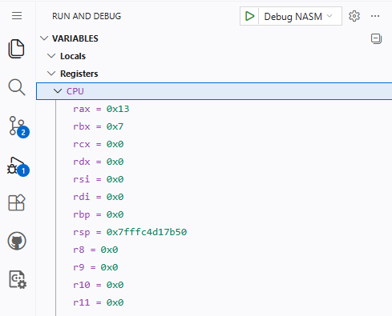

# NASM-Lab1


Pierwsze laboratorium z NASM przygotowane do pracy w środowisku GitHub Codespaces.

## Cel laboratorium

Celem zajęć jest zapoznanie studenta z:
- strukturą prostego programu w asemblerze NASM,
- podstawowymi rejestrami procesora,
- instrukcjami `mov`, `add` oraz `sub`,
- uruchamianiem programu w debuggerze GDB,
- obserwacją zmian stanu rejestrów podczas wykonywania programu.

## Struktura projektu

- `src/main.asm` — plik zawierający główną implementację programu w asemblerze NASM,
- `Makefile` — plik opisujący sposób kompilacji i budowania programu,
- `.vscode/launch.json` — konfiguracja sesji uruchomieniowych i debugowania w edytorze VS Code,
- `.vscode/tasks.json` — konfiguracja zadań automatyzujących proces budowania w VS Code,
- `.devcontainer/` — katalog zawierający konfigurację środowiska uruchamianego w GitHub Codespaces.

## Budowanie programu

Program można zbudować ręcznie poleceniem:

```bash
make
```

W standardowej konfiguracji projektu ręczne wywołanie `make` nie jest jednak konieczne przed uruchomieniem debugowania w VS Code.
Jeżeli w pliku `launch.json` ustawiono parametr `preLaunchTask`, edytor automatycznie uruchomi zadanie budowania przed rozpoczęciem sesji debugowania.

## Uruchamianie programu

Program jest uruchamiany z poziomu debuggera w VS Code.
W standardowej konfiguracji przed rozpoczęciem debugowania automatycznie wykonywane jest zadanie budowania projektu.

Najprostszy sposób uruchomienia:
1. Otwórz panel **Run and Debug**.
2. Wybierz konfigurację debugowania.
3. Naciśnij `F5`.

Alternatywnie debugowanie można uruchomić również z poziomu palety poleceń albo skrótu `Ctrl+Shift+D`.

## Debugowanie

Podczas debugowania można obserwować:
- bieżącą instrukcję,
- wartości rejestrów procesora,
- kolejne zmiany stanu programu po wykonaniu instrukcji.

W szczególności warto śledzić rejestry `rax`, `rbx`, `rcx` oraz `rdx`, ponieważ są one używane w pierwszych ćwiczeniach do analizy działania programu.

Poniżej przedstawiono przykładowy widok panelu **Run and Debug** w VS Code podczas pracy z programem NASM.
W tym miejscu można śledzić przebieg wykonania programu oraz obserwować wartości rejestrów.



Przydatne polecenia GDB:

```gdb
break _start
run
si
info registers
display /i $pc
```

## Program startowy

Program startowy zawiera wyłącznie sekcję `.text` i wykonuje proste operacje na rejestrach. Jego celem jest umożliwienie pierwszego kontaktu z:
- punktem wejścia `_start`,
- instrukcjami arytmetycznymi,
- śledzeniem wykonania programu krok po kroku.

## Zadania

1. Uruchom program i prześledź jego działanie w debuggerze.
2. Zapisz wartości wybranych rejestrów po każdej instrukcji.
3. Zmień wartości stałych użytych w instrukcjach i sprawdź, jak wpływa to na wynik.
4. Dopisz własne instrukcje `mov`, `add` i `sub`.
5. W kolejnych zadaniach rozbuduj program o sekcje `.data`, `.bss` i `.rodata`.

## Uwagi

Pliki wynikowe kompilacji nie powinny być commitowane do repozytorium.
Są one ignorowane przez `.gitignore`.

_Last updated: 2026-06-26_
